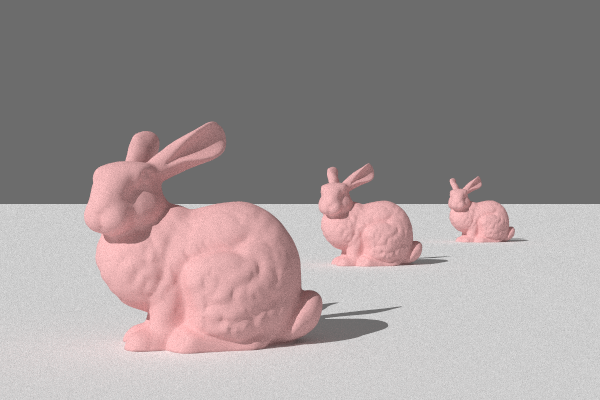

# Bonsly Raytracer 
**Bonsly Raytracer** is a raytracing rendering done by Togla Onay and me for the lecture [Computer Graphics](https://graphics.cg.uni-saarland.de/courses/cg1-2024/index.html) during the winter semester 2024/2025 at Saarland University. The lecture team provided the Lightwave framework, and students are supposed to implement many different features above it. Many things such as perspective camera model, point light and directional light, as well as denoising are handled by our renderer.

More about Lightwave framework can be found [here](https://github.com/Wycole/Bonsly/blob/main/docs/README.md).

## Features
* Perspective camera model
* Triangle meshes(polygon), rectangle, and sphere primtives
* Diffuse, conductor, dielectric, and principled BSDFs
* Image and checkerboard textures
* Shading Normals
* Alpha masking

And there are some highlighted features with images shown below.
* Thin lens camera
<table>
<tr>
  <td align="center">with Perspective Camera</td>
  <td align="center">with Thin Lens Camera</td>
</tr>
<tr>
    <td>
    <td>
</tr>
</table>

* Halton sampler
<table>
<tr>
  <td align="center">Independent Sampling</td>
  <td align="center">Halton Sampling</td>
</tr>
<tr>
    <td>
    <td>
</tr>
</table>

* Image denoising
* Rough dielectric
## How to run
After building the project with CMake you can either run all local tests:
```bash
  python ./run_tests.py
```
or render your own XML scene file using:
```bash
  <path/to/scene> scene.xml
```
